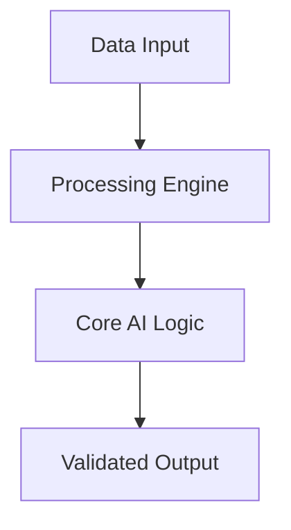

# 🚀 Automated Mlops Orchestrator

Production-grade MLOps pipeline for automated model training, validation, and deployment cycles.

## 🏗️ Architecture

## 🌟 Features
- High-performance algorithms
- Modular & Scalable design
- Automated MLOps integration

Developed by **Marcos Garcia** (Lead AI Engineer).